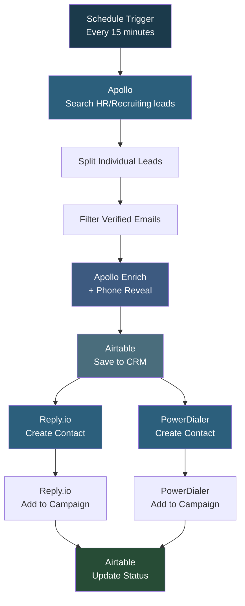

# HRMDSP v2

## Overview

This automation is a **scheduled lead generation pipeline targeting HR and recruitment professionals**. Every 15 minutes, it searches Apollo for Recruiters, Talent Acquisition specialists, HR Managers, and Staffing Managers in the US with verified emails, enriches them with phone numbers, saves to Airtable CRM, and pushes to both Reply.io (email sequences) and PowerDialer (phone campaigns) simultaneously. It updates Airtable with the final status after all pushes complete.

## How It Works

```
Schedule (15min) -> Apollo Search -> Filter Verified -> Enrich + Phone -> Airtable CRM -> Reply.io + PowerDialer in Parallel -> Update Status
```

### Workflow Diagram



## Integrations

- **Apollo.io** - Lead search and phone number enrichment
- **Airtable** - CRM and lead tracking
- **Reply.io** - Email outreach sequences
- **PowerDialer** - Phone calling campaigns

## Setup

1. Import `HRMDSP_v2.json` into your n8n instance.
2. Update Apollo API key, Airtable credentials, Reply.io API key, and PowerDialer API key.
3. Replace placeholder IDs for Airtable base/table, Reply.io campaign, and PowerDialer campaign.
4. Activate the workflow to run every 15 minutes.
